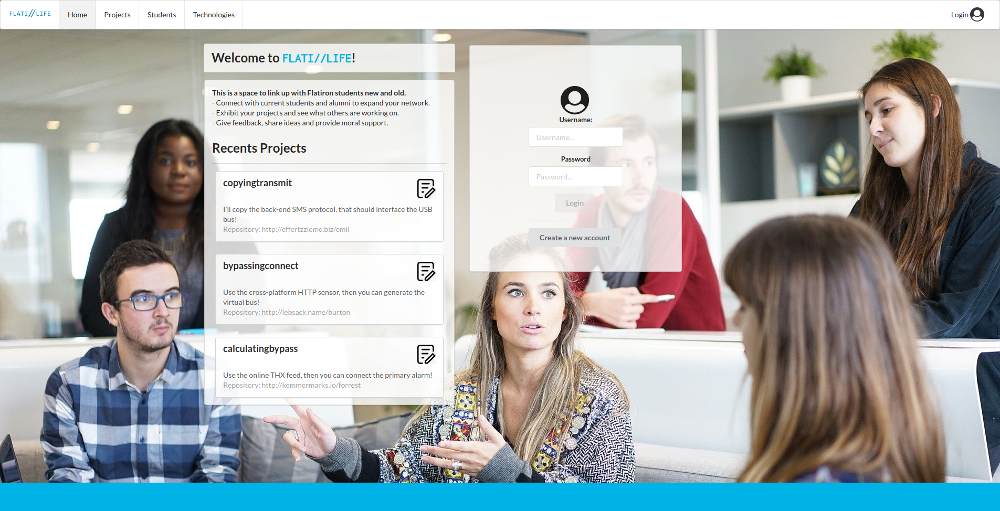

## FlatiLife Frontend
This is a space to link up with Flatiron students new and old.
- Connect with current students and alumni to expand your network.
- Exhibit your projects and see what others are working on.
- Give feedback, share ideas and provide moral support.

## Developed with:
- Javascript, ReactJS and Redux
- Semantic-UI framework and custom CSS

## To run this project
- Make sure you run first FLATI//LIFE backend. Click here to go to the backend https://github.com/jdromero88/flati-life-backend
- Clone this repository
- Open a terminal & go to the directory and run the next commands
- run: npm install (Runs the app in the development mode.)
- run: npm start (Start the app in your browser http://localhost:3001 )

## Preview

